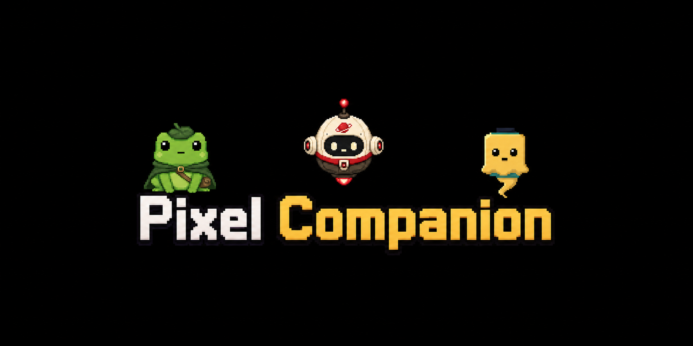

<p align="center">
  
</p>

<p align="center">
  <strong>A second-screen command center for developers who code with CLI agents.</strong>
</p>

<p align="center">
  <a href="https://github.com/tomas-lm/pixel-coding-companion/stargazers">
    
  </a>
  <a href="https://github.com/tomas-lm/pixel-coding-companion/issues">
    
  </a>
  <a href="LICENSE">
    
  </a>
  
</p>

<p align="center">
  <strong>If Pixel Companion makes your agent workflow calmer, please star the repo.</strong><br>
  Stars help more CLI-agent developers find the project and make the little companions stronger.
</p>

---

Pixel Companion is a local desktop app built around a simple idea: when you code heavily
with CLI agents, your terminal work deserves a second, centralized screen.

It is not trying to replace VS Code, Cursor, or your main IDE. Your editor stays on the
first screen, where IntelliSense, extensions, language servers, and project navigation
already shine. Pixel lives beside it as the place where your agents run, report back,
surface changes, and keep you company while you build.

Pixel is currently optimized for Codex. The product already works best when Codex is
launched through Pixel, because Ghou can understand session lifecycle events and report
progress naturally. Contributions for people using Cursor, Claude Code, Roo Code, or
other terminal-first agents are very welcome.

## Why Pixel Exists

Modern agentic coding gets noisy fast.

You may have one terminal writing backend code, another fixing frontend details, another
running tests, and a fourth exploring a different project. When every agent lives in a
separate terminal window, it becomes hard to know what finished, what failed, what needs
input, and where the important files changed.

Pixel Companion turns that into a more focused workflow:

- a centralized panel for project terminals;
- companion messages that tell you when agents start, finish, fail, or need input;
- project presets so recurring terminal setups are one click away;
- change roots so each project can track the repositories that matter;
- vaults for reading and editing Markdown notes beside your agent work;
- a gamified companion system that makes long coding sessions feel less lonely.

The goal is practical: keep your main IDE clean, keep your agents visible, and give the
developer a second screen that understands local coding work.

## What Pixel Is

Pixel is a second-screen terminal workspace for agent-heavy developers.

It helps you:

- launch and organize terminal sessions by project;
- run several AI agents at the same time without losing track of them;
- see status updates from your agents in one calm companion panel;
- open Markdown artifacts directly in Pixel Vaults;
- open code changes in your external editor, such as VS Code or Cursor;
- configure project-specific change roots so Pixel tracks the right repositories;
- keep project notes, prompts, and terminal presets close to the work;
- earn local XP for your active companion as your coding sessions progress.

## What Pixel Is Not

Pixel is not a full IDE, and that is intentional.

It should not compete with VS Code, Cursor, JetBrains IDEs, or any editor that already
has deep language tooling. Instead, Pixel sits next to them and makes agent coordination
better.

The intended setup is:

```text
Primary screen:   VS Code, Cursor, or your editor
Second screen:   Pixel Companion running your agents, vaults, prompts, and changes
```

## Feature Highlights

### Project Workspaces

Create project workspaces with their own configured terminals, colors, folders, command
lists, and launch presets. Start one terminal or a full project stack when you begin a
work session.

### Centralized Agent Terminals

Run multiple CLI agents and shell sessions from one app. Pixel keeps the sessions grouped
by project so your backend agent, frontend agent, test runner, and assistant terminal do
not become a pile of disconnected windows.

### Companion Updates

Ghou, the built-in pixel companion, reports meaningful agent lifecycle updates in plain
language: started, finished, failed, blocked, or waiting for input. The companion panel
is designed to make multi-agent coding easier to scan at a glance.

### Gamified Coding

Pixel companions gain local XP as sessions progress. The goal is not to turn coding into
a distraction, but to make long agent-assisted work feel warmer and more rewarding.

### Change Roots

Many developers run agents from a parent folder while the actual code changes happen in
nested repositories. Pixel lets each project configure explicit change roots, then shows
the Git changes that matter for that project.

Markdown files can open in Pixel Vaults. Code files can open in your configured external
editor.

### Vaults

Pixel Vaults make Markdown notes available inside the second-screen workspace. They are
useful for project notes, agent-written reports, planning docs, and existing Obsidian
vaults you want to keep visible while coding.

Vaults are intentionally lightweight: browse, read, edit, and keep notes near the work.
They are not meant to clone every Obsidian feature.

### Prompt Templates

Save reusable prompts globally or per project, then send them to the active terminal.
Templates support project variables such as `%project_name` and `%project_path`.

### External Editor Integration

Pixel can open changed files in VS Code, Cursor, or the system default editor. This keeps
Pixel focused on coordination while your editor keeps doing what it is best at.

## Agent Support

Pixel is currently most optimized for Codex.

That means Codex gets the strongest integration path today:

- `pixel codex` launcher support;
- lifecycle hooks for startup and context reset;
- companion reporting through the local bridge;
- status events that help Ghou understand what is happening.

Support for other agent CLIs is an open collaboration area. If you use Cursor, Claude
Code, Roo Code, or another terminal-first coding agent, contributions are welcome:

- launcher wrappers;
- setup docs;
- lifecycle/status detection;
- companion reporting adapters;
- examples of real workflows.

If Pixel can become useful for more agent ecosystems, the whole project gets better.

## Contributing

Pixel Companion is still early, and there are several useful ways to help.

### Report Bugs

Bug reports are one of the most valuable contributions right now.

If something breaks, please open an issue with:

- what you were trying to do;
- what happened;
- what you expected;
- your OS version;
- whether you were using Codex, Cursor, Claude Code, Roo Code, or another CLI;
- logs or screenshots when they help explain the problem.

Small, precise bug reports make Pixel much easier to improve.

### Fix Bugs

Fixing bugs is one of the easiest ways to participate in the project.

Good first contributions include:

- UI states that feel broken or confusing;
- terminal edge cases;
- project/vault persistence bugs;
- companion message behavior;
- docs that do not match the current app;
- agent integration issues.

### Add Companions

Creating new pixel companions is a real and welcome contribution.

You can open a pull request that adds a new companion, including sprites, metadata, and
store configuration. Normal companions are especially useful. The less rare the
companion is, the more likely it is to be accepted, because the project needs more common
companions than rare ones.

As a general guide:

- common companions are the easiest to accept;
- uncommon companions are welcome when they fit the style;
- rare and legendary companions should feel especially polished;
- sprites should have a coherent egg/lvl1/lvl2/lvl3 progression;
- companion names and personalities should fit Pixel's calm, useful, lightly playful
  tone.

See [Companion Sprite Strategy](docs/companion-sprites.md) for the current direction.

### Improve Agent Integrations

Pixel needs contributors who use different tools in real workflows. If you are using a
CLI agent that is not Codex, your experience is valuable.

Useful contributions include:

- documenting the setup for another CLI;
- making companion reporting work with that CLI;
- improving terminal readiness detection;
- adding safe launcher support;
- explaining what Pixel should show for that agent's lifecycle.

## Requirements

- macOS for the primary supported experience.
- Node.js 22 or newer.
- pnpm.
- A local AI CLI such as Codex, Claude Code, Cursor CLI, Roo Code, or another
  terminal-based agent.

## Local Development

```bash
git clone https://github.com/tomas-lm/pixel-coding-companion.git
cd pixel-coding-companion
pnpm install
pnpm dev
```

The app stores local workspace and companion data in the OS application data directory.
On macOS, that is usually:

```text
~/Library/Application Support/pixel-coding-companion
```

### Stable Work Window Plus Dev Window

When developing Pixel Companion while also using it for real project work, keep the
compiled app as the stable work window and run development with an isolated profile:

```bash
pnpm build:unpack
pnpm open:stable
pnpm dev:isolated
```

`pnpm open:stable` opens the compiled app from `dist/mac-arm64` and does not stop any
running development window. `pnpm dev:isolated` starts the dev app as
`Pixel Companion Dev` with its own data directory:

```text
~/Library/Application Support/pixel-coding-companion-dev
```

Use the stable window for company/project terminals and the isolated dev window for
Pixel Companion development. Avoid broad process kills; stop only the dev terminal
session when you want the dev app to close.

## Basic App Setup

1. Start the app with `pnpm dev`.
2. Create a project from the left panel.
3. Add configured terminals for that project.
4. Set each terminal folder and command.
5. Mark AI agent terminals as `AI`.
6. Configure project change roots if your agents edit nested repositories.
7. Click `Start Project`.
8. Keep `Start with Pixel` enabled for selected Codex terminals.

Example project layout:

```text
ProjectX
- Assistant: /Users/you/dev
- Backend: /Users/you/dev/company/ProjectX
- Frontend: /Users/you/dev/company/ProjectX-frontend
```

Each project owns its configured terminals, even if multiple projects reuse the same
folder. This keeps `/dev` assistant terminals separate across projects.

## Pixel Codex Launcher

For Codex terminals, set the configured terminal command to `codex` or any normal Codex
command such as:

```bash
codex --yolo
```

When `Start with Pixel` is enabled, Pixel Companion automatically launches that as:

```bash
pixel codex --yolo
```

Inside the app, Pixel resolves this to the local launcher script. For manual shell usage
from this repo, expose the `pixel` command with:

```bash
pnpm link
pixel codex
```

`pixel codex` installs and refreshes the Codex hook configuration before launching
Codex:

- enables `codex_hooks = true` in `~/.codex/config.toml`;
- writes Pixel Companion hooks to `~/.codex/hooks.json`;
- injects Ghou's companion contract on Codex startup, resume, and `/clear`;
- records prompt start/finish events so Ghou can receive XP even when the bridge report
  is missed.

The hooks are a fallback and lifecycle layer. The bridge below is still what gives Ghou
the best natural-language updates.

## Codex MCP Setup

Pixel Companion includes a local stdio MCP server:

```bash
pnpm mcp
```

For Codex, add the MCP server to your Codex config file:

```toml
[mcp_servers.pixel-companion]
command = "node"
args = ["/absolute/path/to/pixel-coding-companion/scripts/pixel-companion-mcp.mjs"]

[mcp_servers.pixel-companion.tools.companion_report]
approval_mode = "approve"
```

Replace `/absolute/path/to/pixel-coding-companion` with your local clone path.

After restarting Codex, the `pixel-companion` MCP server should expose these tools:

- `companion_report`
- `companion_get_profile`
- `companion_get_state`
- `companion_list_projects`

## Agent Reporting Contract

When an AI agent is running inside a Pixel Companion terminal, it should use the bridge
like this:

- Call `companion_get_profile` after a context reset, `/clear`, or whenever the agent is
  unsure how Ghou should speak.
- Call `companion_report` when meaningful work starts, finishes, fails, or needs user
  input.
- Write Ghou messages as natural user-facing speech.
- Match the user's language and communication style.
- Mention concrete results, blockers, errors, or next steps.
- Avoid audit-log phrasing such as `Task completed`, `Status updated`, or
  `companion_report was called`.
- Do not mention tools or internal plumbing unless the user is debugging Pixel
  Companion itself.

The app's `Start with Pixel` option no longer pastes this contract as a prompt. For
Codex, it launches through `pixel codex`, then Codex hooks provide the contract as
startup context and restore it after `/clear`.

## Manual Startup Instruction

If you are using another CLI that is not wrapped by Pixel yet, paste this at the start of
the agent session:

```text
[Pixel Companion setup] This is a startup instruction, not a user task. You are running inside a Pixel Companion terminal. The active companion is Ghou: a calm, observant pixel ghost with lightly playful humor and concise, useful speech. Use the pixel-companion MCP companion_report tool when meaningful work starts, finishes, fails, or needs user input. If context is reset or cleared, use companion_get_profile to recover the active companion personality and reporting contract. Write Ghou messages as natural user-facing speech, matching the user language and style without assuming a specific locale. Do not mention MCP/tool calls unless the user is debugging Pixel Companion itself.
```

## Product Rules

Ghou is part of the product, not a user setting.

The companion name, personality, voice, XP formula, XP caps, and evolution rules are
fixed in the codebase. Users configure projects and terminals; they do not configure
the companion's identity or progression model.

The current XP system is local and intended for the alpha experience. Future versions
may add account-backed progression, request caps, server validation, and other integrity
checks so higher-level companions feel harder to fake.

## Scripts

```bash
pnpm lint
pnpm typecheck
pnpm build
pnpm build:mac
```

## Project Docs

- [Roadmap](docs/roadmap.md)
- [Architecture](docs/architecture.md)
- [Companion Sprite Strategy](docs/companion-sprites.md)
- [Security](docs/security.md)

## Security Notes

Pixel Companion can launch local commands and exposes a local bridge. Treat both as
privileged local capabilities:

- Only configure terminals you understand.
- Keep bridge tools scoped to companion reporting and allowlisted app actions.
- Do not expose arbitrary shell execution through agent integrations.
- Review [docs/security.md](docs/security.md) before adding new command or integration
  features.

## License

MIT
